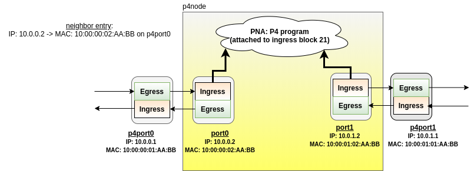

# Dependency

1) The descriptions assume you are running these sample progs using the vagrant
machines from here:
https://github.com/p4tc-dev/p4tc-tutorial-pub

2) Currently using simple traffic generator from here:
https://github.com/ebiken/sendpacket

# Topology

Run the build-simple-p4 script to build the topology as illustrated below.



# Examples

cd to each example and read the approriate READMEs.

# Make using docker
From this level, you can call `devenv.sh` directly. You can also call from within the individual projects using the symlink to `devenv.sh`
```
./devenv.sh make -C <directory> <target [targets ...] [params]>
```
e.g.
```
./devenv.sh make -C roce/ generate
```
